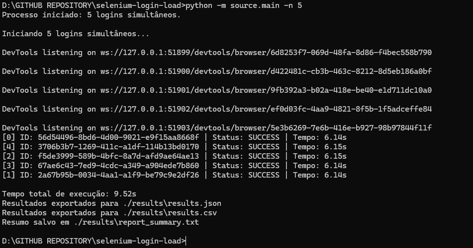

# Simultaneous Login Automation - Python + Selenium Grid

Automate multiple configurable simultaneous logins to the test application:  
[https://the-internet.herokuapp.com/login](https://the-internet.herokuapp.com/login)

---
**Documentation in Portuguese**

<div align="left">
  <a href="https://github.com/Vidigal-code/selenium-login-load/blob/main/README_PT.md">
    <strong>» Click here to view the official Portuguese documentation «</strong>
  </a>
</div>

---

## Example 

 

---

 

---


## How to use Python

1. Install dependencies:
   ```bash
   pip install -r requirements.txt
   ```

2. Download the ChromeDriver matching your Chrome version.
   - Set the path in `.env` (`CHROMEDRIVER_PATH`).

3. Run:
   ```bash
   python -m source.main -n 5
   ```

## How to use Docker


1. Build Docker image:
   ```bash
   docker compose build
   ```

2. Run:
   ```bash
   docker compose up
   ```

- Results are saved in the `/results` volume.
- ChromeDriver is managed automatically in the container.

## Features

- User-defined number of concurrent logins
- Each login uses an isolated WebDriver
- Success/failure validation
- Results exported to results folder
- Centralized messages for errors and system feedback
- **Docker orchestration for local execution**

## Folder structure

```
source/
├─ main.py
├─ system/
│  ├─ login_worker.py
│  ├─ run_logins.py
├─ config/
│  ├─ driverconfig.py
├─ messages/
│  ├─ message_errors.py
│  ├─ message_system.py
requirements.txt
.env
README.md
Dockerfile
docker-compose.yml
entrypoint.sh
```

## Configuration

### `.env` (example)

```dotenv
MIN_LOGINS=1
MAX_LOGINS=1000
SEQUENCE=RANDOM
CONCURRENT_LOGINS=5
MAX_CONCURRENT=2
HEADLESS=true
PAGE_LOAD_TIMEOUT=30
ELEMENT_WAIT_TIMEOUT=10
LOGIN_USERNAME=tomsmith
LOGIN_PASSWORD=SuperSecretPassword!
OUTPUT_DIR=./results
OUTPUT_DIR_SCREENSHOT=./results/screenshot
OUTPUT_DIR_HTML=./results/html
SAVE_SCREENSHOTS=true
SAVE_HTML_ON_FAILURE=true
EXPORT_JSON=true
EXPORT_CSV=true
TARGET_URL=https://the-internet.herokuapp.com/login
TARGET_URL_TO_CHECK=/secure
CHROMEDRIVER_PATH=/usr/bin/chromedriver # Docker Config or windows C:\WebDriver\bin\chromedriver.exe
```

## ChromeDriver: Windows, Mac, Linux

- Always download ChromeDriver matching your Chrome version!
- [Google Chrome for Testing: Downloads](https://googlechromelabs.github.io/chrome-for-testing)
- For local execution (Windows, Mac, Linux), set `CHROMEDRIVER_PATH` in `.env`.
- For Docker/Grid, ChromeDriver setup is automatic.
