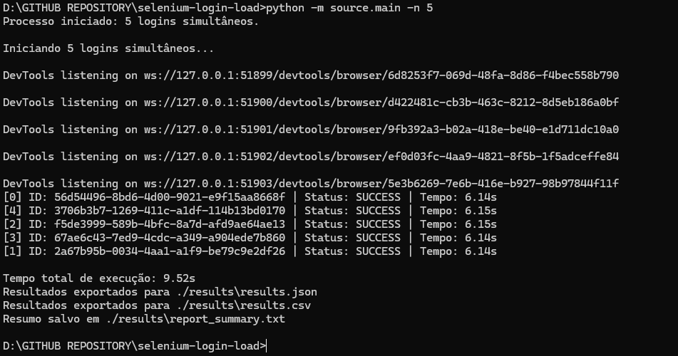
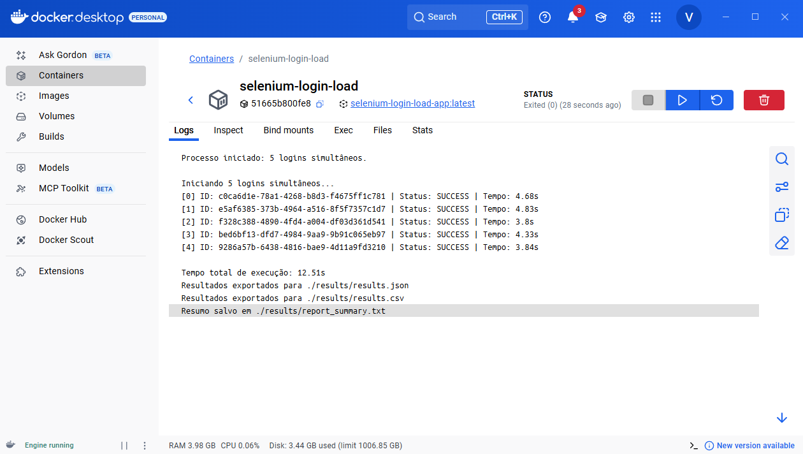
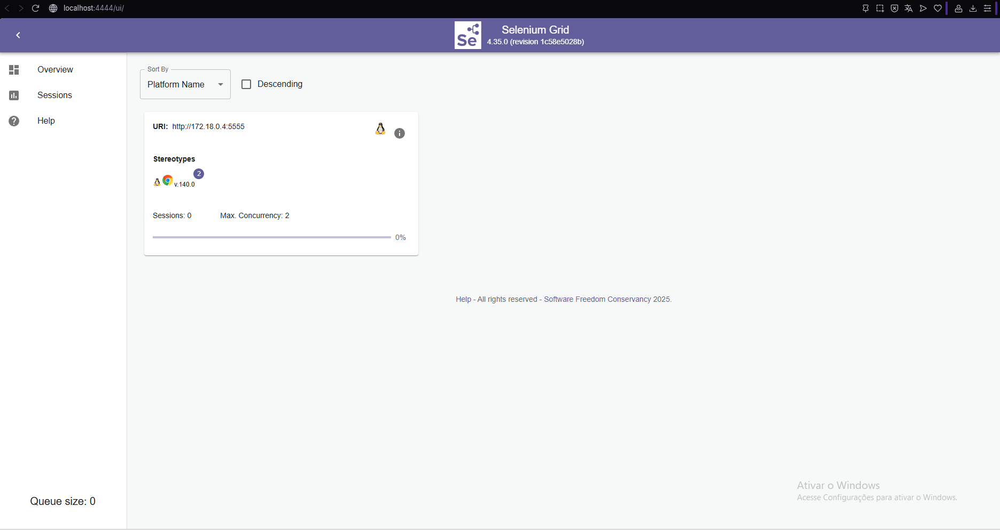
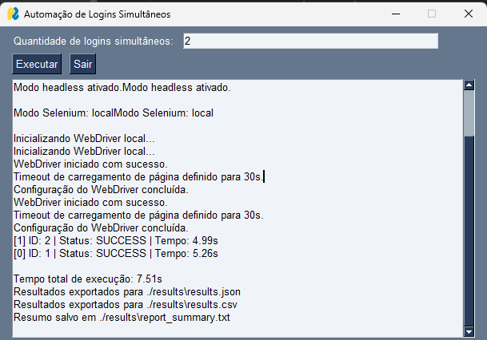

# Automação de Logins Simultâneos - Python + Selenium Grid

Automatize múltiplos logins simultâneos e configuráveis na aplicação de teste:  
[https://the-internet.herokuapp.com/login](https://the-internet.herokuapp.com/login)

---

## Exemplo 

 

---

## Exemplo Docker



---

## Exemplo Selenium Grid

 

---

## Exemplo Interface Gui

 

---

## 📚 Documentação

- [README.md](./README.md) — Documentação em inglês.

---


## Índice

- [Objetivo do Projeto](#objetivo-do-projeto)
- [Funcionalidades](#funcionalidades)
- [Estrutura de Pastas](#estrutura-de-pastas)
- [Configuração](#configuração)
- [Execução](#execução)
- [Resultados Gerados](#resultados-gerados)
- [Escalabilidade & Produção](#escalabilidade--produção)
- [Monitoramento & Auditoria](#monitoramento--auditoria)
- [ChromeDriver: Windows, Mac, Linux](#chromedriver-windows-mac-linux)
- [FAQ](#faq)

---

## Objetivo do Projeto

Automatizar múltiplos logins simultâneos em [the-internet.herokuapp.com/login](https://the-internet.herokuapp.com/login) usando Python 3.13+, Selenium 4+, com quantidade configurável pelo usuário.  
O tempo total de execução é calculado e exibido, junto com o status de cada login (sucesso ou falha).  
Validação de sucesso, exportação de artefatos e preparação para produção via Selenium Grid e Docker.

---

## Funcionalidades

- Entrada do usuário: configure o número de logins simultâneos via CLI ou interface gráfica.
- Execução paralela: múltiplos WebDrivers independentes (threads e Selenium Grid).
- Sequenciamento configurável (`SEQUENCE=INCREASING|DECREASING|RANDOM`)
- Artefatos organizados por ID: screenshots e HTML salvos em pastas por login.
- Login automatizado: usuário `tomsmith`, senha `SuperSecretPassword!`.
- Cálculo do tempo total: logs e exibição após execução.
- Validação de sucesso: verifica redirecionamento para página de sucesso.
- Exportação dos resultados: JSON, CSV, TXT, screenshots e HTML (para sucesso e falha).
- Docker + Selenium Grid pronto para produção.
- Monitoramento via artefatos e logs.
- **Mensagens centralizadas**: arquivos `message_errors.py` e `message_system.py` facilitam personalização, tradução e auditoria.

---

## Estrutura de Pastas

```
selenium-login-load/
├─ source/
│  ├─ main.py                        # Ponto de entrada principal (CLI/GUI)
│  ├─ interface/
│  │    ├─ gui.py                    # Interface gráfica (opcional)
│  ├─ system/
│  │    ├─ login_worker.py           # Worker individual de login
│  │    ├─ run_logins.py             # Orquestrador de logins
│  ├─ config/
│  │    ├─ driverconfig.py           # Configuração do WebDriver
│  ├─ messages/
│  │    ├─ message_errors.py         # Mensagens de erro centralizadas
│  │    ├─ message_system.py         # Mensagens de sistema/sucesso centralizadas
├─ results/
│  ├─ results.json
│  ├─ results.csv
│  ├─ report_summary.txt
│  ├─ screenshot/
│  │    ├─ ID-uuid/
│  │    │    └─ uuid.png
│  ├─ html/
│  │    ├─ ID-uuid/
│  │    │    └─ uuid.html
├─ .env
├─ .dockerignore
├─ .gitignore
├─ generate_compose_cli.py
├─ generate_compose_grid.py
├─ requirements.txt
├─ Dockerfile
├─ docker-compose.yml
├─ entrypoint.sh
├─ README_PT.md
├─ README_PROD_PT.md
├─ README_PROD.md
└─ README.md
```

---

## Configuração

### `.env` (exemplo)

```dotenv
# Limites configuráveis para logins simultâneos!
MIN_LOGINS=1      # Mínimo permitido de logins simultâneos.
MAX_LOGINS=1000   # Máximo permitido de logins simultâneos.

# SEQUENCE define o tipo de sequência de IDs (INCREASING, DECREASING, RANDOM)
SEQUENCE=RANDOM     # INCREASING, DECREASING, RANDOM

# Número de logins simultâneos (total de tentativas)
CONCURRENT_LOGINS=50

# Máximo de threads/processos concorrentes
MAX_CONCURRENT=10

# Executar navegador em modo headless? Use 'true' para produção.
HEADLESS=true

# Timeout máximo para carregamento de página (segundos)
PAGE_LOAD_TIMEOUT=30

# Timeout máximo para espera de elementos (segundos)
ELEMENT_WAIT_TIMEOUT=10

# Usuário de login
LOGIN_USERNAME=tomsmith

# Senha de login
LOGIN_PASSWORD=SuperSecretPassword!

# Pasta principal de resultados
OUTPUT_DIR=./results

# Pasta para screenshots de login
OUTPUT_DIR_SCREENSHOT=./results/screenshot

# Pasta para salvar HTML por login
OUTPUT_DIR_HTML=./results/html

# Salvar screenshots dos resultados (true/false)
SAVE_SCREENSHOTS=true

# Salvar HTML da página após falha no login (true/false)
SAVE_HTML_ON_FAILURE=true

# Exportar resultados para JSON (true/false)
EXPORT_JSON=true

# Exportar resultados para CSV (true/false)
EXPORT_CSV=true

# Modo de execução do Selenium ('local' para máquina local, 'grid' para Selenium Grid)
SELENIUM_MODE=local

# URL do Selenium Hub (usado apenas no modo grid)
SELENIUM_REMOTE_URL=http://selenium-hub:4444/wd/hub

# URL da página de login (aplicação alvo)
TARGET_URL=https://the-internet.herokuapp.com/login

# Fragmento de URL indicando sucesso no login (usado para validação)
TARGET_URL_TO_CHECK=/secure

# Habilitar/desabilitar Selenium Grid (true/false)
USE_GRID=false

# Número de nós Chrome no Grid (usado no docker-compose)
GRID_NODES=3

# Caminho local do ChromeDriver (necessário para execução local no Windows)
# Docker Config or windows C:\WebDriver\bin\chromedriver.exe
CHROMEDRIVER_PATH=/usr/bin/chromedriver
```

---

### `.env` (execução grid docker)

```dotenv
# Valor mínimo permitido para logins simultâneos.
MIN_LOGINS=1

# Valor máximo permitido para logins simultâneos.
MAX_LOGINS=1000

# Tipo de sequência dos IDs dos logins: INCREASING, DECREASING ou RANDOM.
SEQUENCE=RANDOM

# Quantidade de logins simultâneos (total de tentativas).
CONCURRENT_LOGINS=50

# Máximo de threads/processos concorrentes.
MAX_CONCURRENT=10

# Executa o navegador em modo headless (sem interface gráfica). Use 'true' para produção.
HEADLESS=true

# Tempo máximo para carregar uma página (em segundos).
PAGE_LOAD_TIMEOUT=30

# Tempo máximo para esperar elementos na página (em segundos).
ELEMENT_WAIT_TIMEOUT=10

# Usuário para login.
LOGIN_USERNAME=tomsmith

# Senha para login.
LOGIN_PASSWORD=SuperSecretPassword!

# Pasta principal para salvar resultados.
OUTPUT_DIR=./results

#  Pasta para screenshots de cada login.
OUTPUT_DIR_SCREENSHOT=./results/screenshot

# Pasta para salvar HTML de cada login.
OUTPUT_DIR_HTML=./results/html

# Salva screenshots dos resultados dos logins (true/false).
SAVE_SCREENSHOTS=true

# Salva HTML da página após falha no login (true/false).
SAVE_HTML_ON_FAILURE=true

# Exporta resultados em JSON (true/false).
EXPORT_JSON=true

# Exporta resultados em CSV (true/false).
EXPORT_CSV=true

# Modo de execução do Selenium ('local' para rodar na máquina ou 'grid' para usar Selenium Grid).
SELENIUM_MODE=grid

#  URL do Selenium Hub (usado apenas no modo grid).
SELENIUM_REMOTE_URL=http://selenium-hub:4444/wd/hub

# URL da página de login (aplicação alvo).
TARGET_URL=https://the-internet.herokuapp.com/login

# Fragmento da URL que indica sucesso do login (usado para validar redirecionamento).
TARGET_URL_TO_CHECK=/secure

# Habilita/desabilita uso do Selenium Grid (true/false).
USE_GRID=true

# Quantidade de nodes Chrome no Grid (usado no docker-compose).
GRID_NODES=1

# Caminho do ChromeDriver local (necessário para execução local no Windows).
# Docker Config or windows C:\WebDriver\bin\chromedriver.exe
CHROMEDRIVER_PATH=
```

---

## Execução

### Local

1. Instale as dependências:
   ```bash
   pip install -r requirements.txt
   ```
2. Instale o ChromeDriver compatível com sua versão do Chrome:
   - [Google Chrome for Testing: Downloads](https://googlechromelabs.github.io/chrome-for-testing)
   - Windows: 
     - 64-bit: [Win64 chromedriver](https://storage.googleapis.com/chrome-for-testing-public/140.0.7339.207/win64/chromedriver-win64.zip)
     - 32-bit: [Win32 chromedriver](https://storage.googleapis.com/chrome-for-testing-public/140.0.7339.207/win32/chromedriver-win32.zip)
   - Mac:
     - [chromedriver-mac-arm64.zip](https://storage.googleapis.com/chrome-for-testing-public/140.0.7339.207/mac-arm64/chromedriver-mac-arm64.zip)
     - [chromedriver-mac-x64.zip](https://storage.googleapis.com/chrome-for-testing-public/140.0.7339.207/mac-x64/chromedriver-mac-x64.zip)
   - Linux:
     - [chromedriver-linux64.zip](https://storage.googleapis.com/chrome-for-testing-public/140.0.7339.207/linux64/chromedriver-linux64.zip)
   - Mais informações: [ChromeDriver Docs](https://developer.chrome.com/docs/chromedriver/downloads?hl=pt)
3. Execute logins:
   ```bash
   python -m source.main -n 10
   ```
   - Altere o número conforme desejar.
   - Use `SEQUENCE=INCREASING`, `SEQUENCE=DECREASING` ou `SEQUENCE=RANDOM` no `.env` para mudar a ordem/IDs.

# Docker + Selenium Grid (Produção)

## 1. Construa os containers

```bash
docker compose build
```

## 2. Inicie o ambiente completo

```bash
docker compose up
```
- O aplicativo detecta automaticamente o modo Grid ou Local a partir do seu `.env`:
  - Se `SELENIUM_MODE=grid`, utiliza o Selenium Grid.
  - Se `SELENIUM_MODE=local`, executa localmente.
- Os logs mostrarão **tempo gasto** e **status** para cada tentativa de login.

## 3. Gerar e iniciar com o script Python Grid

```bash
python generate_compose_grid.py
```
- Este script:
  - Gera automaticamente um `docker-compose.yml` com o número de nós definido no `.env` (`GRID_NODES`)
  - Exclui qualquer arquivo anterior de `docker-compose.yml`
  - Executa: `docker compose up --build`

## 4. Gerar e iniciar com o script Python CLI

```bash
python generate_compose_cli.py
```
- Este script:
  - Gera automaticamente um `docker-compose.yml`
  - Exclui qualquer arquivo anterior de `docker-compose.yml`
  - Executa: `docker compose up --build`

---

### Interface Gráfica

```bash
python -m source.main --gui
```
- Insira a quantidade desejada e clique em **Executar**.

---

## Resultados Gerados

- `results/results.json` → Detalhes de cada login (ID, tempo, status, erro, screenshot, HTML)
- `results/results.csv` → Exportação em CSV
- `results/report_summary.txt` → Resumo com tempo total e status de cada login
- `results/screenshot/ID-uuid/uuid.png` → Screenshot (sucesso e falha)
- `results/html/ID-uuid/uuid.html` → HTML (sucesso e falha)

---

## Escalabilidade & Produção

- Paralelismo configurável via `MAX_CONCURRENT` e `CONCURRENT_LOGINS`
- Grid distribuído para centenas de logins simultâneos
- Pronto para cloud/on-premises
- Adaptável para outros cenários de autenticação

---

## Monitoramento & Auditoria

- Logs em container e CLI mostram tempo total e status por login
- Artefatos de sucesso e erro salvos para investigação
- Relatórios exportados em formatos profissionais
- **Mensagens centralizadas** em:
  - `source/message_errors.py`: erros específicos de módulo.
  - `source/message_system.py`: sucesso, status e mensagens do sistema.
- Facilita tradução, auditoria e manutenção.

---

## ChromeDriver: Windows, Mac, Linux

- Baixe sempre o ChromeDriver compatível com sua versão do Chrome!
- [Google Chrome for Testing: Downloads](https://googlechromelabs.github.io/chrome-for-testing)
- Para execução local (Windows, Mac, Linux), defina `CHROMEDRIVER_PATH` no `.env`.
- Para Docker/Grid, configuração do ChromeDriver é automática.

---

## FAQ

**Preciso do ChromeDriver localmente?**  
- Só para execução local. Não é necessário para Grid/Docker.

**Como ajustar para mais ou menos logins?**  
- Edite `CONCURRENT_LOGINS` no `.env` ou use o argumento `-n`.

**Quais artefatos são usados para auditoria?**  
- JSON, CSV, TXT, PNG e HTML gerados na pasta `results/`.

**Como escalar para centenas de logins?**  
- Ajuste `MAX_CONCURRENT` e `CONCURRENT_LOGINS` no `.env` e aumente os nós Chrome no `docker-compose.yml`.

**Como definir sequência de IDs e ordem de exibição?**  
- Use `SEQUENCE=INCREASING`, `SEQUENCE=DECREASING` ou `SEQUENCE=RANDOM` no `.env`.

**PySimpleGUI não funciona?**  
- Siga as instruções do README para instalar pelo repositório privado.

---

## Contato

Para dúvidas, sugestões ou bugs, abra uma [issue](https://github.com/Vidigal-code/).

---

## Observações Extras

- O código atende 100% dos requisitos do desafio, pronto para produção.
- Artefatos gerados tanto para sucesso quanto para falha, visando auditoria.
- Mantido atualizado para Python 3.13.7, Selenium 4+, Docker e Grid.
